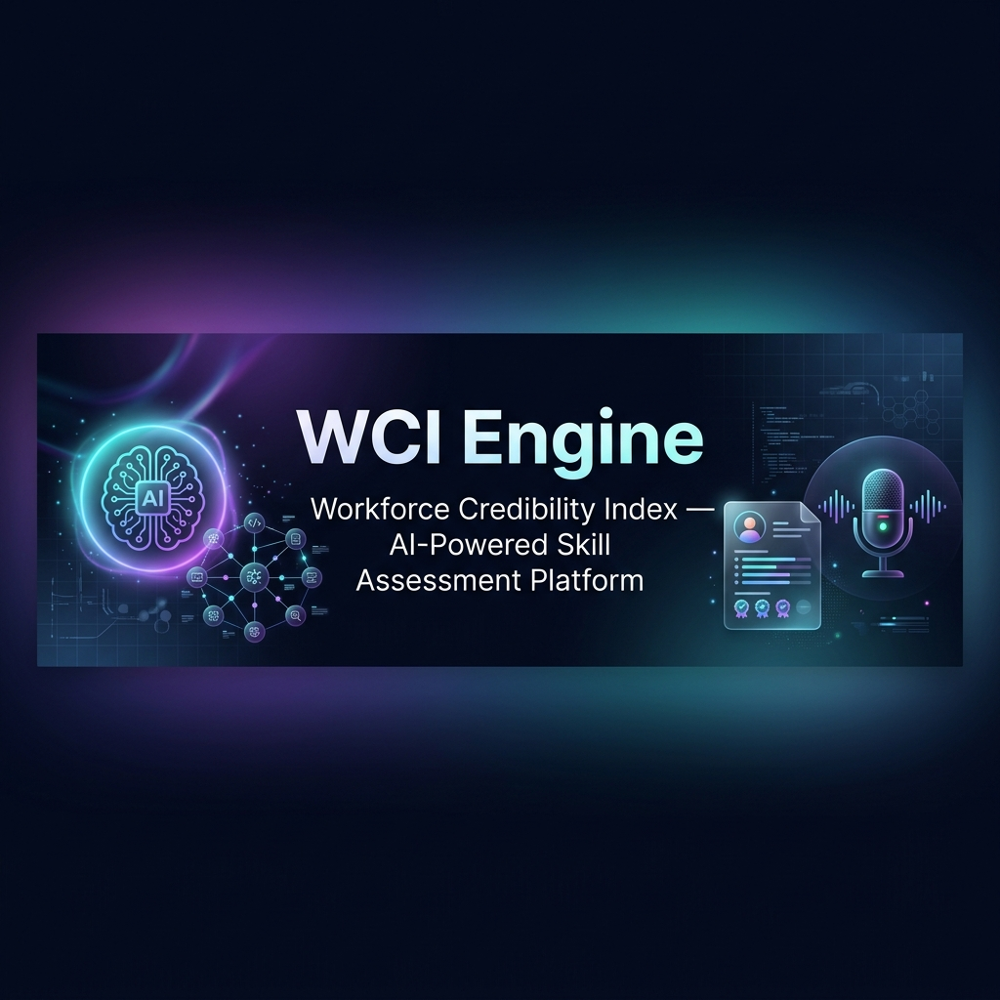
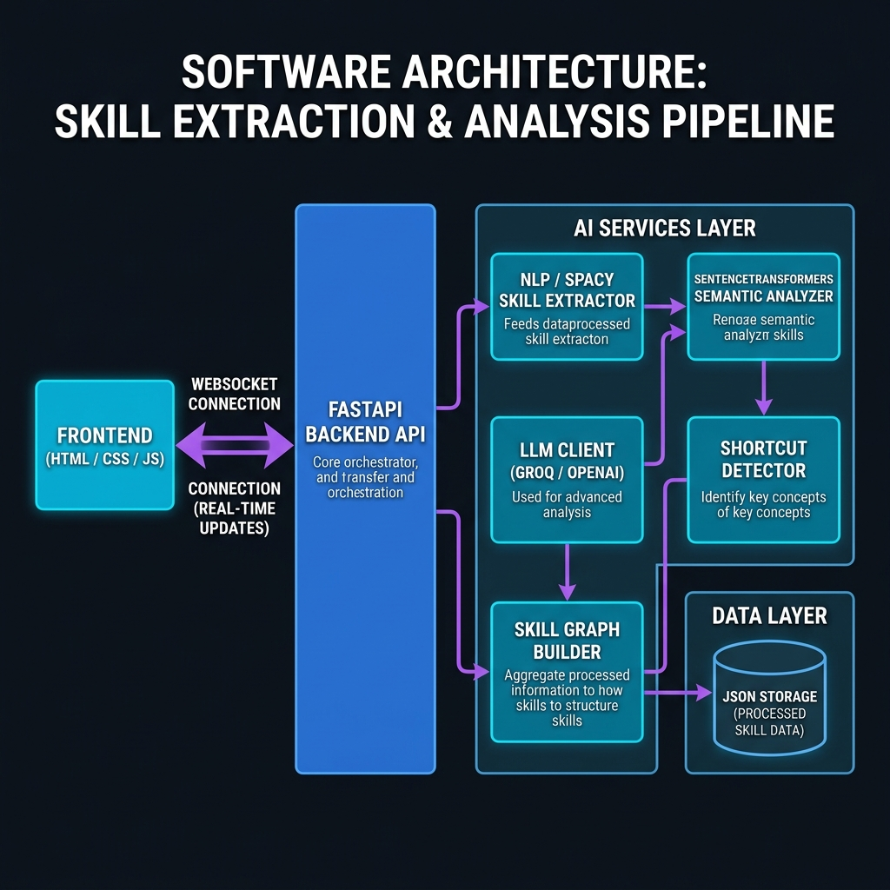

<p align="center">
  
</p>

<h1 align="center">⚡ WCI Engine — Workforce Credibility Index</h1>

<p align="center">
  <b>An AI-Powered, Adaptive Skill Assessment & Interview Platform</b><br/>
  Built with FastAPI · spaCy · SentenceTransformers · Groq LLM · Vanilla JS
</p>

<p align="center">
  
  
  
  
  
</p>

---

## 📌 About the Project

**WCI Engine** is a premium, AI-driven recruitment and skill assessment platform designed for the modern hiring ecosystem. It uses advanced NLP and LLMs to conduct adaptive interviews, semantically analyze candidate responses, detect AI-generated or template-based shortcuts, and generate deep credibility reports — all in real time.

> 🎓 Built as a **Semester 6 EDAI** project under the theme of Intelligent Skill-Based Hiring using AI.

---

## 🏗️ Architecture

<p align="center">
  
</p>

The system is split into three layers:
- **Frontend** — Vanilla HTML/CSS/JS serving candidate and recruiter dashboards
- **Backend** — FastAPI server handling REST APIs and WebSocket connections
- **AI Services** — NLP pipeline (spaCy + SentenceTransformers + LLM) for intelligent analysis

---

## ✨ Key Features

### 👤 Candidate Side
| Feature | Description |
|---|---|
| 📄 **Resume Parsing** | AI extracts and categorizes skills from uploaded PDFs automatically |
| 🎯 **Adaptive Interview** | 10-question interview where difficulty adjusts based on real-time performance |
| 🧠 **Semantic Analysis** | Uses SentenceTransformers to evaluate conceptual depth, not just keywords |
| 🚨 **Shortcut Detection** | Detects template-matching or AI-generated patterns in answers |
| 📊 **Credibility Report** | Deep-dive analysis with WCI score, skill breakdown & learning recommendations |
| 🕸️ **Skill Graph** | Interactive Canvas-based visualization of skill dependencies & knowledge gaps |
| 💻 **Coding Test** | Live in-browser coding challenge with evaluation |
| 🏋️ **Practice Mode** | Practice interviews separate from official scored sessions |

### 🧑‍💼 Recruiter Side
| Feature | Description |
|---|---|
| 📺 **Live Monitor** | Watch candidate interviews in real-time via WebSockets |
| 📡 **Live Transcript** | Real-time behavioral signals: eye contact, voice confidence, transcript |
| 📋 **Candidate Management** | Search, filter, and export performance data to CSV |
| 📈 **Analytics Dashboard** | Global stats, active interviews, and shortcut alerts |
| 🔔 **Nudge System** | Send real-time alerts to candidates during interviews |
| 📸 **Snapshot View** | Live webcam snapshots of candidates during sessions |

---

## 🛠️ Tech Stack

```
Backend          FastAPI, Uvicorn, Python 3.11, Pydantic, WebSockets
NLP / AI         spaCy (en_core_web_sm), SentenceTransformers (all-MiniLM-L6-v2)
LLM Integration  Groq (llama3), OpenAI (gpt-4), Anthropic Claude (fallback chain)
Resume Parsing   PyPDF2
Frontend         HTML5, CSS3, Vanilla JavaScript, Canvas API
3D Assets        Three.js / GLB models (AI avatar)
Data Storage     JSON (local flat-file persistence)
```

---

## 🚀 Quick Start

### 1. Clone the Repository
```bash
git clone https://github.com/SaniyaNirmale/Intelligent-Skill-Based-Hiring-Interview-System-using-AI.git
cd Intelligent-Skill-Based-Hiring-Interview-System-using-AI
```

### 2. Install Dependencies
```bash
pip install -r requirements.txt
```

### 3. Download the spaCy NLP Model
```bash
python -m spacy download en_core_web_sm
```

### 4. Configure API Keys
Create a `.env` file in the root directory:
```env
# Groq (Recommended — fast & free tier available)
GROQ_API_KEY=your_groq_key_here

# OpenAI (fallback)
OPENAI_API_KEY=your_openai_key_here

# Anthropic (optional fallback)
ANTHROPIC_API_KEY=your_anthropic_key_here
```
> 💡 The system auto-selects the best available provider: **Groq → OpenAI → Anthropic → Offline fallback**

### 5. Run the Server
```bash
python -m uvicorn backend.main:app --reload --port 8000
```

### 6. Open the App
Visit **[http://localhost:8000](http://localhost:8000)** in your browser.

---

## 📁 Project Structure

```
wci-engine/
│
├── backend/
│   ├── main.py                  # FastAPI app entry point + WebSocket handlers
│   ├── routes/
│   │   ├── auth.py              # Registration & login
│   │   ├── resume.py            # PDF upload & skill extraction
│   │   ├── interview.py         # Interview session management
│   │   ├── report.py            # Report generation
│   │   ├── candidate.py         # Candidate profile & data
│   │   ├── recruiter.py         # Recruiter dashboard APIs
│   │   └── coding.py            # Coding challenge APIs
│   ├── services/
│   │   ├── skill_extractor.py   # NLP-based skill extraction from resumes
│   │   ├── question_engine.py   # Adaptive question generation
│   │   ├── answer_analyzer.py   # Semantic answer scoring
│   │   ├── shortcut_detector.py # AI/template response detection
│   │   ├── scoring_engine.py    # WCI score computation
│   │   ├── report_generator.py  # Report compilation
│   │   ├── skill_graph_builder.py # Skill dependency graph
│   │   ├── coding_engine.py     # Coding test evaluation
│   │   └── llm_client.py        # Multi-provider LLM abstraction
│   └── data/                    # JSON flat-file storage (gitignored)
│
├── frontend/
│   ├── index.html               # Landing page
│   ├── login-candidate.html
│   ├── login-recruiter.html
│   ├── register.html
│   ├── candidate/               # All candidate-facing pages
│   │   ├── dashboard.html
│   │   ├── resume.html
│   │   ├── interview.html
│   │   ├── official-interview.html
│   │   ├── practice-interview.html
│   │   ├── coding-test.html
│   │   ├── report.html
│   │   ├── skill-graph.html
│   │   ├── analytics.html
│   │   ├── jobs.html
│   │   └── recommendations.html
│   └── recruiter/               # All recruiter-facing pages
│       ├── dashboard.html
│       ├── live-monitor.html
│       ├── candidates.html
│       ├── reports.html
│       ├── analytics.html
│       └── settings.html
│
├── assets/readme/               # README images
├── requirements.txt
└── .env.example                 # Environment config template
```

---

## 🔄 How It Works

### For Candidates
```
Register/Login → Upload Resume → AI Extracts Skills
     → Start Interview → Adaptive Questions (Easy→Hard)
     → Semantic Answer Scoring + Shortcut Detection
     → View Credibility Report + Skill Graph
```

### For Recruiters
```
Register/Login → Dashboard Overview → Create Job Roles
     → Monitor Live Interviews (WebSocket feed)
     → View Candidate Reports → Export CSV Data
```

---

## 🌐 API Documentation

Once the server is running, visit the interactive Swagger UI:

**[http://localhost:8000/docs](http://localhost:8000/docs)**

---

## ⚠️ Important Notes

- The **`.env` file is gitignored** — never commit API keys to version control
- First startup may take ~30–60 seconds as AI models load into memory
- The `backend/data/` folder stores user data locally (also gitignored)
- If you encounter a `numpy dtype` error, run: `pip install "numpy<2.0" --force-reinstall`

---

## 👩‍💻 Author

**Saniya Nirmale** — Semester 6, EDAI Project

---

<p align="center">
  Made with ❤️ and a lot of AI
</p>
